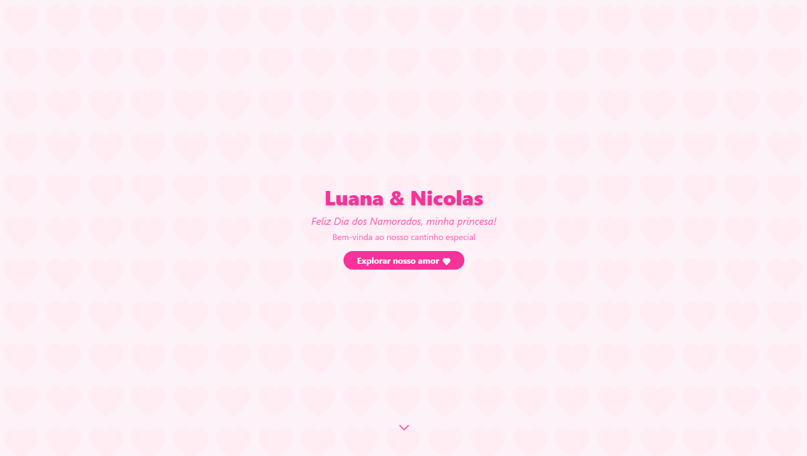

# 💌 Website de Dia dos Namorados

<p>
  
</p>
<br />
Um <b>website interativo, moderno e responsivo</b> desenvolvido como presente de Dia dos Namorados para a <b>Luana</b>. O projeto utiliza <b>React</b>, <b>React Router</b>, <b>Tailwind CSS</b>, <b>Framer Motion</b> e <b>AOS</b> para proporcionar uma experiência fluida, <b>mobile first</b> e cheia de animações.

<div align="center">
  
</div>

A interface foi cuidadosamente desenhada para ser <b>visualmente atraente, acolhedora e fácil de usar</b>, com foco total em dispositivos móveis. O layout é totalmente responsivo, garantindo beleza e funcionalidade em qualquer tela. Animações suaves, ícones personalizados e transições tornam a navegação envolvente e especial. O uso de Tailwind CSS permite personalização rápida e moderna, enquanto Framer Motion e AOS trazem vida aos elementos da página.

---

## 🚀 Tecnologias e Estrutura

-   <b>React + Vite:</b> Estrutura SPA para navegação rápida e eficiente.
-   <b>React Router:</b> Navegação entre páginas (início, carta) e tratamento de rotas 404.
-   <b>Tailwind CSS:</b> Estilização moderna, responsiva e mobile first.
-   <b>Framer Motion & AOS:</b> Animações suaves e interativas em toda a interface.
-   <b>Componentização:</b> Código organizado em componentes reutilizáveis para fácil manutenção e personalização.

---

## ✨ Funcionalidades (Ordem de Uso)

1. <b>Boas-vindas:</b> Mensagem inicial de boas-vindas personalizada.
2. <b>Cronômetro de Tempo Juntos:</b> Mostra em tempo real há quanto tempo o casal está junto.
3. <b>Linha do Tempo Animada:</b> Exibe os principais marcos e memórias do relacionamento de forma visual e animada.
4. <b>Motivos do Amor:</b> Lista de motivos, revelados sequencialmente com animação, mostrando o porquê do amor.
5. <b>Caixa de Mensagens de Amor:</b> Frases românticas rotativas, com transições suaves e suporte a quebras de linha.
6. <b>Abraço Virtual:</b> Animação fofa de abraço com emoji, transmitindo carinho à distância.
7. <b>Seção da Carta:</b> Botão que abre um modal de confirmação e redireciona para uma página dedicada à carta de amor.
8. <b>Carta Especial:</b> Página exclusiva com uma carta animada e personalizada para a Luana.
9. <b>SVG Personalizado:</b> Ícone de carta customizável para dar charme visual ao site.
10. <b>Footer:</b> Rodapé com assinatura personalizada.

---

## 🛠️ Como rodar o projeto

1. <b>Instale as dependências:</b>

    ```sh
    npm install
    # ou
    yarn
    ```

2. <b>Execute o site localmente:</b>

    ```sh
    npm run dev
    # ou
    yarn dev
    ```

3. <b>Abra no navegador:</b>

    Acesse [http://localhost:5173](http://localhost:5173)

---

## 🗂️ Estrutura do Projeto

-   <b>src/App.jsx</b> — Componente principal e configuração das rotas
-   <b>src/components/</b> — Todos os componentes de UI (TimeCounter, Timeline, LoveReasons, LetterBox, etc.)
-   <b>src/index.css</b> — Estilos do Tailwind e customizações

---

## 📄 Licença

> **Este projeto é um presente pessoal, feito sob medida para a Luana, e não deve ser utilizado, copiado ou distribuído para fins comerciais ou outros propósitos sem autorização.**
>
> **Todos os direitos reservados.**

---
